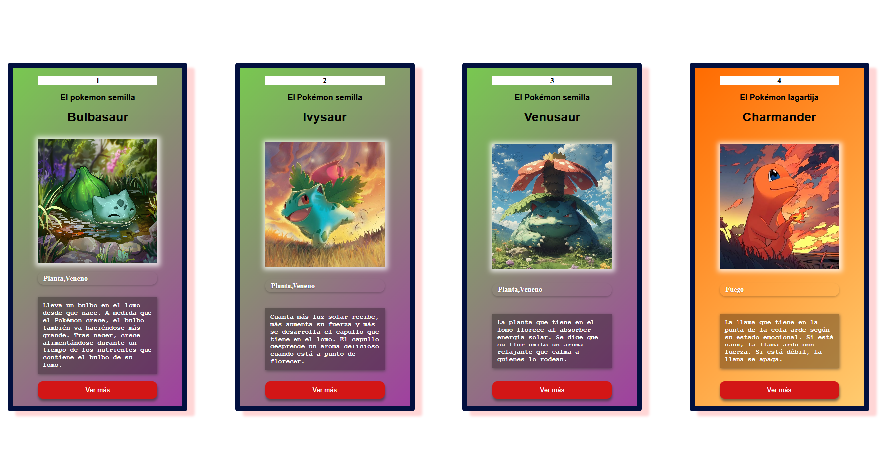
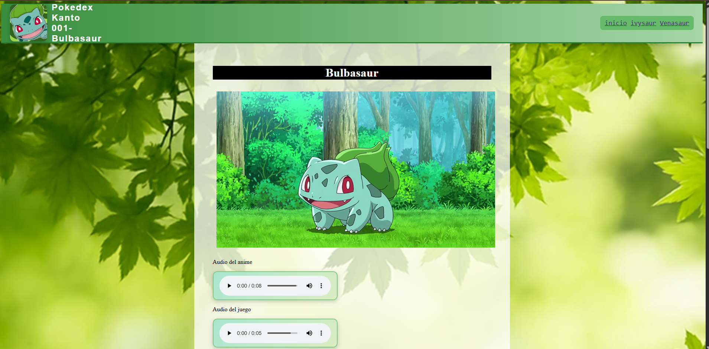
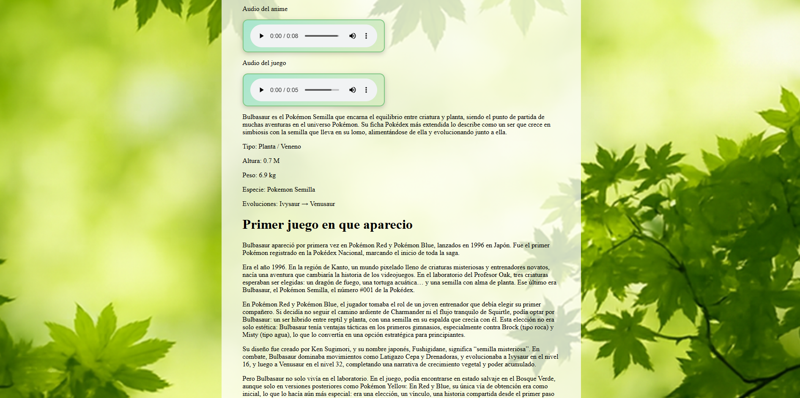
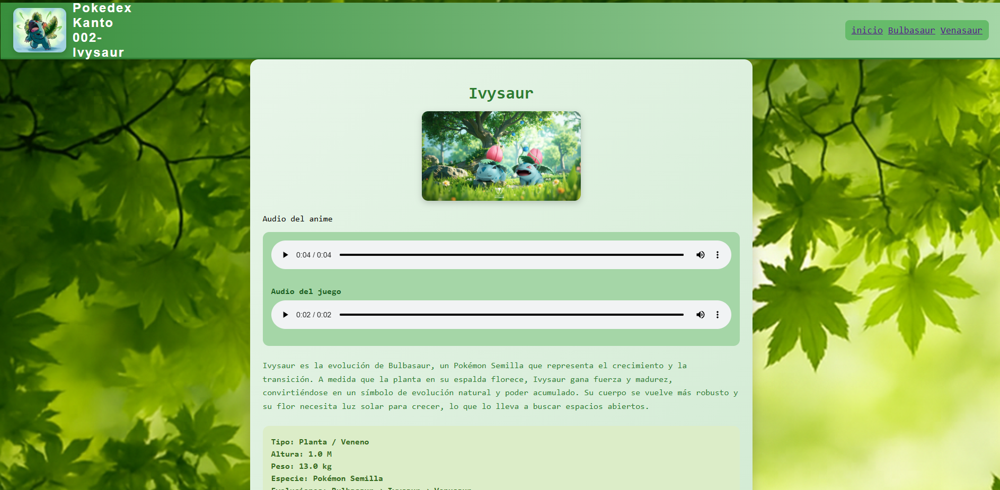

# Enciclopedia Pokemon 

## Esta es una enciclopedia de pokemon, en donde se podra ver datos curiosos de ellos, como sus sonidos, sus gestos y sus fotos con una breve descipcion de los mismos

## Esta es la vercion 1.1.0 de la Aplicacion



# vercion, 1.2.0

## se agrego la pagina de Bulbasaur y se corrigieron errores tipograficos anteriores, como que la aplicacion a la cual se le llamaba "Pagina".



## la aplicacion contiene audios del pokemon tantos provenientes del anime como de los juegos, aparte de esto tambien se agregaron datos de la primera aparicion del pokemon como a su vez  datos de los mismos 



# vercion 1.2.1

## se incluyo la pagina de Ivysaur se cambio el estilo visual de las paginas al entrar a los pokemon



### Esto es un ejemplo del codigo 

```javascript
{

ID: 1,
Nombre:"Bulbasaur",
Tipos: ["Planta","Veneno"],
Evoluciones: ["Ivysaur", "Venusaur"],
megaevoluciones: [],
Altura: "0.7",
peso: "6.9 kg",
Habilidades: ["Espesura", "Clorofila (oculta)"],
Imagen: './image/bulbasaur.png',
Especie: 'El pokemon semilla',
Descripcion: "Lleva un bulbo en el lomo desde que nace. A medida que el Pokémon crece, el bulbo también va haciéndose más grande. Tras nacer, crece alimentándose durante un tiempo de los nutrientes que contiene el bulbo de su lomo.",

}

